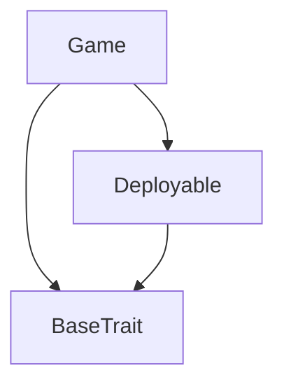

# TACT Compilation Report
Contract: Game
BOC Size: 2364 bytes

# Types
Total Types: 12

## StateInit
TLB: `_ code:^cell data:^cell = StateInit`
Signature: `StateInit{code:^cell,data:^cell}`

## Context
TLB: `_ bounced:bool sender:address value:int257 raw:^slice = Context`
Signature: `Context{bounced:bool,sender:address,value:int257,raw:^slice}`

## SendParameters
TLB: `_ bounce:bool to:address value:int257 mode:int257 body:Maybe ^cell code:Maybe ^cell data:Maybe ^cell = SendParameters`
Signature: `SendParameters{bounce:bool,to:address,value:int257,mode:int257,body:Maybe ^cell,code:Maybe ^cell,data:Maybe ^cell}`

## Deploy
TLB: `deploy#946a98b6 queryId:uint64 = Deploy`
Signature: `Deploy{queryId:uint64}`

## DeployOk
TLB: `deploy_ok#aff90f57 queryId:uint64 = DeployOk`
Signature: `DeployOk{queryId:uint64}`

## FactoryDeploy
TLB: `factory_deploy#6d0ff13b queryId:uint64 cashback:address = FactoryDeploy`
Signature: `FactoryDeploy{queryId:uint64,cashback:address}`

## GameInfo
TLB: `_ p1Addr:address p2Addr:address p1Move:uint256 p2Move:uint256 winnerAddr:Maybe address status:uint256 = GameInfo`
Signature: `GameInfo{p1Addr:address,p2Addr:address,p1Move:uint256,p2Move:uint256,winnerAddr:Maybe address,status:uint256}`

## AssignPlayerContractAddr
TLB: `assign_player_contract_addr#7f576821 playerContractAddr:address = AssignPlayerContractAddr`
Signature: `AssignPlayerContractAddr{playerContractAddr:address}`

## NewGame
TLB: `new_game#e06a3a7b p1Addr:address p2Addr:address = NewGame`
Signature: `NewGame{p1Addr:address,p2Addr:address}`

## SelectMove
TLB: `select_move#ca4af13e gameId:uint256 playerNo:uint256 move:uint256 = SelectMove`
Signature: `SelectMove{gameId:uint256,playerNo:uint256,move:uint256}`

## UpdatePlayerInfo
TLB: `update_player_info#a4683204 p1Addr:address p2Addr:address winnerAddr:address = UpdatePlayerInfo`
Signature: `UpdatePlayerInfo{p1Addr:address,p2Addr:address,winnerAddr:address}`

## AddWinLoss
TLB: `add_win_loss#686d81ca p1Addr:address p2Addr:address winnerAddr:address = AddWinLoss`
Signature: `AddWinLoss{p1Addr:address,p2Addr:address,winnerAddr:address}`

# Get Methods
Total Get Methods: 4

## id

## counter

## getplayerContractAddr

## getGameInfo
Argument: gameId

# Error Codes
2: Stack underflow
3: Stack overflow
4: Integer overflow
5: Integer out of expected range
6: Invalid opcode
7: Type check error
8: Cell overflow
9: Cell underflow
10: Dictionary error
13: Out of gas error
32: Method ID not found
34: Action is invalid or not supported
37: Not enough TON
38: Not enough extra-currencies
128: Null reference exception
129: Invalid serialization prefix
130: Invalid incoming message
131: Constraints error
132: Access denied
133: Contract stopped
134: Invalid argument
135: Code of a contract was not found
136: Invalid address
137: Masterchain support is not enabled for this contract
7608: Error - game info null.
13863: Error - game not exist.
18791: Error - null game info.
27208: Error - game has already ended.
27305: Error - already selected a move.
49762: Error - game if not exist.
59842: Error - move number outbound.

# Trait Inheritance Diagram

# Contract Dependency Diagram

